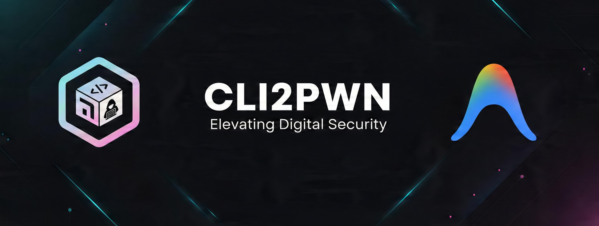

<div align="center">


<br>

<a href="https://github.com/0pwn/CLI2PWN/stargazers"></a>
<a href="https://github.com/0pwn/CLI2PWN/blob/main/LICENSE"></a>
<a href="#the-30-agents"></a>
<a href="https://github.com/antigravity-cli"></a>
<a href="https://attack.mitre.org"></a>
<a href="https://github.com/0pwn/CLI2PWN"></a>

<br><br>

**The Ultimate AI-Powered Offensive Security Framework for the Antigravity CLI.** <br>
*30+ elite, specialized AI agents executing the full offensive research lifecycle with state-of-the-art 2026 TTPs.*

</div>

---

> **⚠️ FOR AUTHORIZED SECURITY TESTING ONLY.** All agents operate within defined research parameters. Security research requires explicit authorization — ensure all targets are explicitly permitted before execution.

## [+] Overview

**CLI2PWN** is a revolutionary, modular, and agentic offensive security environment designed exclusively for the **Antigravity CLI**. It transforms your terminal into a persistent, multi-agent command center tailored for elite vulnerability research, advanced penetration testing, red teaming, and CTF operations.

By leveraging highly specialized, persistent AI agents that retain context and possess deep domain knowledge, CLI2PWN automates complex attack chains, freeing up the human operator to focus on strategy and architecture.

## [*] Key Features & Unique Selling Points

- 🧠 **30+ Elite, Specialized Agents:** An entire cyber warfare team in your terminal. From `/web_assassin` for intricate web exploitation to `/cloud_shadow_admin` for lateral movement in GCP/AWS/Azure.
- 🔄 **Persistent & Context-Aware:** Agents retain state and context across your workspace. They learn from previous command outputs, chained exploits, and share intelligence seamlessly.
- 🎯 **Creative & Modern TTPs (2026 Ready):** CLI2PWN agents don't just run Nmap. They execute out-of-the-box techniques: BYOVD (Bring Your Own Vulnerable Driver) exploitation, AI Red Teaming (jailbreaks, RAG poisoning), and advanced container escapes (eBPF evasion, runc breakouts).
- ⚡ **Antigravity CLI Native:** Highly optimized for the Antigravity ecosystem. Employs optimal tool calling, concurrent subagent invocation, and seamless artifact generation.
- 🧩 **Modular & Extensible:** Easily define custom agents, override system prompts, and inject organization-specific operational security rules.

## [=] Repository Structure

```text
cli2pwn/
├── .agents/
│   ├── agents/         # Live agent profiles and conversational contexts
│   ├── commands/       # Custom slash commands (e.g., /recon, /exploit)
│   ├── hooks/          # Pre/post-execution hooks for OPSEC and logging
│   └── skills/         # The core brain: 30+ highly detailed skill modules
├── cli2pwn.ps1         # Windows entry point & initialization script
├── antigravity-plugin.json # Native plugin manifest for Antigravity
├── README.md           # You are here
└── LICENSE             # MIT License
```

## [~] Installation & Setup

1. **Clone the Repository:**
   ```bash
   git clone https://github.com/0pwn/cli2pwn.git
   cd cli2pwn
   ```

2. **Register the Plugin:**
   Link the framework to your Antigravity global configuration:
   - **Windows:** Copy or symlink the `.agents/skills` to `%USERPROFILE%\.gemini\skills`
   - **Linux/macOS:** Copy or symlink to `~/.gemini/skills`

3. **Initialize the Environment:**
   Run the launcher to bootstrap your workspace and load the persistent agents:
   ```powershell
   # Windows (PowerShell)
   Set-ExecutionPolicy -Scope Process Bypass
   ./cli2pwn.ps1
   ```

## [#] Usage

Once loaded into the Antigravity CLI, you can orchestrate your agents using intuitive slash commands or direct subagent invocation.

### Agent Invocation Examples

```text
/modern_recon target="corp.example.com" mode="stealth"
/container_escape technique="cgroup_release_agent"
/byovd_exploitation driver="ntoskrnl.exe" offset="0x1234"
/ai_red_teaming prompt_injection="true" target_llm="internal-chat"
```

### The Synergy Model
You can ask one agent to collaborate with another. For example, instruct the `/modern_recon` agent to pass its findings to `/web_assassin` for immediate vulnerability analysis, maintaining a seamless kill chain.

## [*] Legal & Ethical Boundaries

Use of this framework for unauthorized access, malicious exploitation, credential theft, or destructive activity is strictly prohibited. Operators are responsible for complying with applicable laws and regulations, including local cybercrime statutes and contractual restrictions. The author is not responsible for any misuse or damage caused by this framework.
